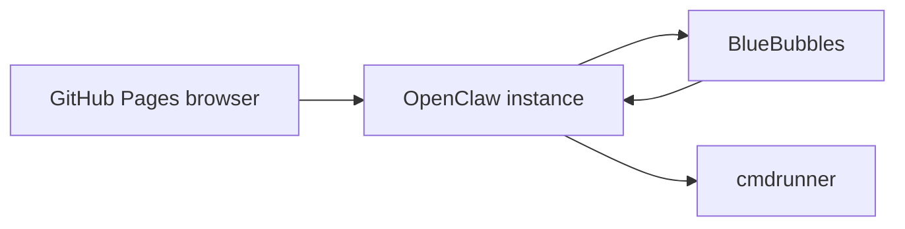

This is a local-only draft to verify code block styling and Mermaid rendering before publishing anything new.

## Example command

```bash
docker compose run --rm site bundle exec jekyll build
```

## Example diagram


