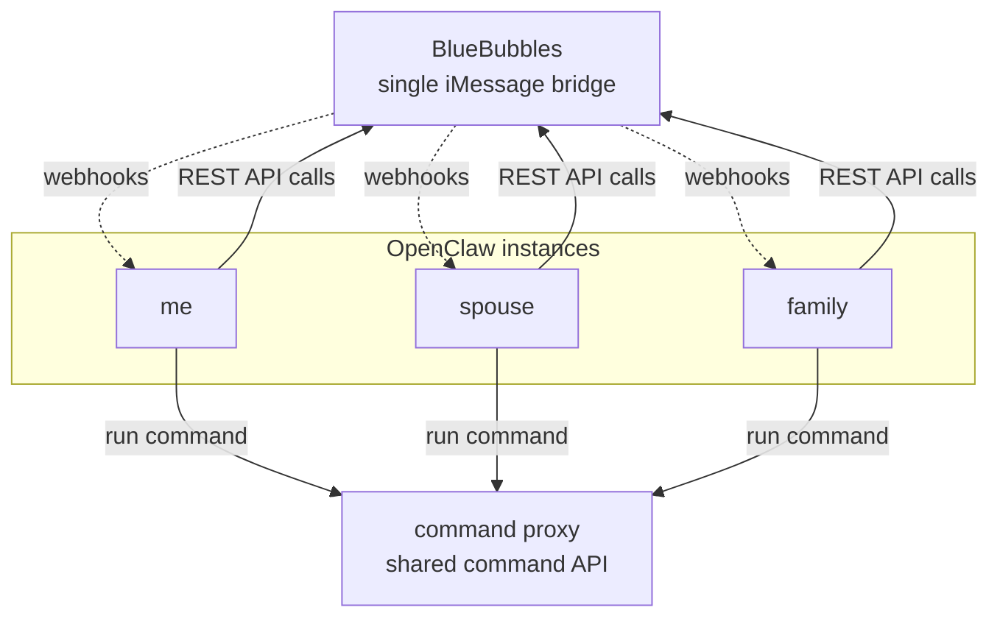

## Why am I writing this?

Like many people, I hesitated initially to install OpenClaw because I was worried about security, but then eventually gave in after I saw all of the cool stuff my friends were doing. The FOMO is strong with OpenClaw right now, and I was unable to resist it. I also _really_ wanted to build something useful for my wife with AI, so that she could experience the magic too. What I ended up with I think is fairly different from what I've seen other people do, so I decided this is a good opportunity to dust off the old blog and share something that is (hopefully) genuinely useful to others.

## Requirements

My requirements were pretty simple:

1. I need 3 agents: one for me, one for my wife, and one for the family.
2. All communication needs to be over iMessage because that's the channel that everyone uses and is most comfortable with. We could have used Telegram or Slack or something like that, but it wouldn't feel as "real" as talking to an agent the same way we do to other humans.
3. The agents have to do actual useful stuff. Things like reading emails, drafting responses, writing code, checking homework, buying groceries, etc. Stuff that requires a level of access that makes me uncomfortable.
4. I have to be able to sleep at night.

## Implementation

OpenClaw easily satisfies the first 3 requirements, it's the 4th where things get complicated.

What I've seen a lot of people do is to just buy a Mac Mini and deploy OpenClaw and let it YOLO to its heart's content. I think that's probably going to work out fine most of the time for most people. But I'm paranoid, and I've seen the horror stories. If OpenClaw starts deleting my family's emails, the "magic" of AI can quickly turn to panic and rage.

Another thing I've seen people do is to lock down the network on the OpenClaw gateway so that it can only talk to specific IP addresses or domains. This approach does make OpenClaw much safer, but there are a couple of reasons it doesn't work great for me:

1. Certain domains, like `github.com`, can absolutely be vectors for prompt injection and exfiltrating sensitive data.
2. I wanted more granular control. For example, if I want my agent to be able to read and draft emails but not send them, giving the agent my IMAP password and locking the network down to my email provider domain isn't going to prevent that.

So I needed to do something different than what I was seeing other people do.

## iMessage

I did some research and it appears that the only way you can use OpenClaw with iMessage is to run it on a macOS device (if there is another way please lmk!). So, begrudgingly, like everyone else I went out and bought a Mac Mini.

OpenClaw has a really nice integration with a project called [BlueBubbles](https://bluebubbles.app/), which basically acts like a web HTTP server and passes messages back and forth through iMessage via webhooks. It works incredibly well, but there was one problem: it only supports one set of webhooks for all iMessage conversations. This meant that I could only run a single OpenClaw gateway, which meant all of my agents had to have the same level of access. That wasn't going to work for me, I didn't want the possibility of the family agent doing things like reading my wife's emails. So I did what any reasonable person would do, and [forked the project to add the functionality I needed](https://github.com/BlueBubblesApp/bluebubbles-server/pull/780). With that patch, the OpenClaw on my Mac Mini can now support separate webhooks for separate iMessage conversations, which allows me to run isolated gateways for each agent. I'm crossing my fingers that one gets merged so I don't have to keep manually patching it.

## Access Controls

This is where it gets interesting. Like I mentioned above, locking down the network was not going to be sufficient for my needs. I needed a way to be extremely granular with the permissions that I gave the agent. What I ended up coming up with was a "command proxy" concept. The command proxy would hold the credentials, and would accept requests from the agents, authenticate them using an agent-specific API key, and then perform the request. For example, the request might be to read my email, or to draft an email response. As long as the agent was authenticated it would perform the action and return the results. I also added the concept of commands that can be requested but that require human approval to be performed. This can be used for things that can't easily be reverted like actually sending emails or making social media posts. One nice side-effect of this approach is that the agent has no access to the actual secrets.

At a high level, the wiring looks like this:

In practice, the `command-proxy` side is just a narrow set of HTTP commands. It's kind of a "SOAP" API which I guess kind of sucks but agents seem to "get" it really well so idk. The important part is that each agent gets a small, explicit set of operations instead of direct access to passwords or long-lived secrets.

| OpenClaw instance | Example command-proxy call | Example payload | What it does |
| --- | --- | --- | --- |
| me | `POST /commands/pull-amazon-transactions` | `{"days":60}` | Pulls recent Amazon purchases and lines them up with unapproved YNAB transactions |
| me | `GET /commands/forgejo-pr-status?state=open` | none | Checks whether an agent job already opened a PR |
| spouse | `GET /commands/gmail/search?account=<elided>&query=newer_than:7d&limit=5` | none | Searches Gmail without exposing the underlying Google credentials |
| family | `GET /commands/inbox?limit=10` | none | Polls the shared Wilson inbox for recent messages |
| spouse | `POST /commands/gmail/draft` | `{"subject":"SOAP API","body":"Why did you build a SOAP API those are so lame?","to":"brian@<elided>"}` | Puts an email draft in a gmail account |
| family | `POST /commands/calendar/events` | `{"title":"Soccer practice","start":"2026-04-15T18:00:00","duration":"PT1H"}` | Creates a calendar event through the command-proxy |

## How is it all working?

It has only been a few weeks, but so far really well! There have been a couple of hiccups, like when BlueBubbles broke during an OpenClaw upgrade, but otherwise everything is working pretty great. Of course a tradeoff of all this is that if I want to add more capabilities for the agents that it's a bit of extra work, but I'm fine with that for the privilege of being able to sleep at night.
