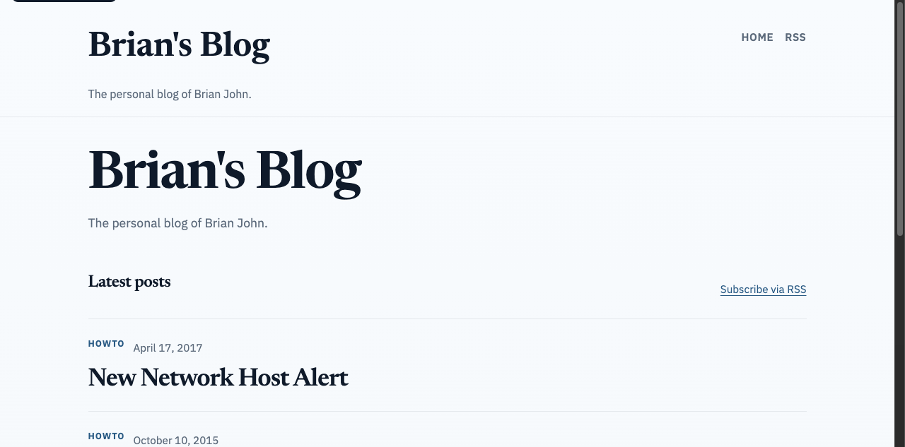
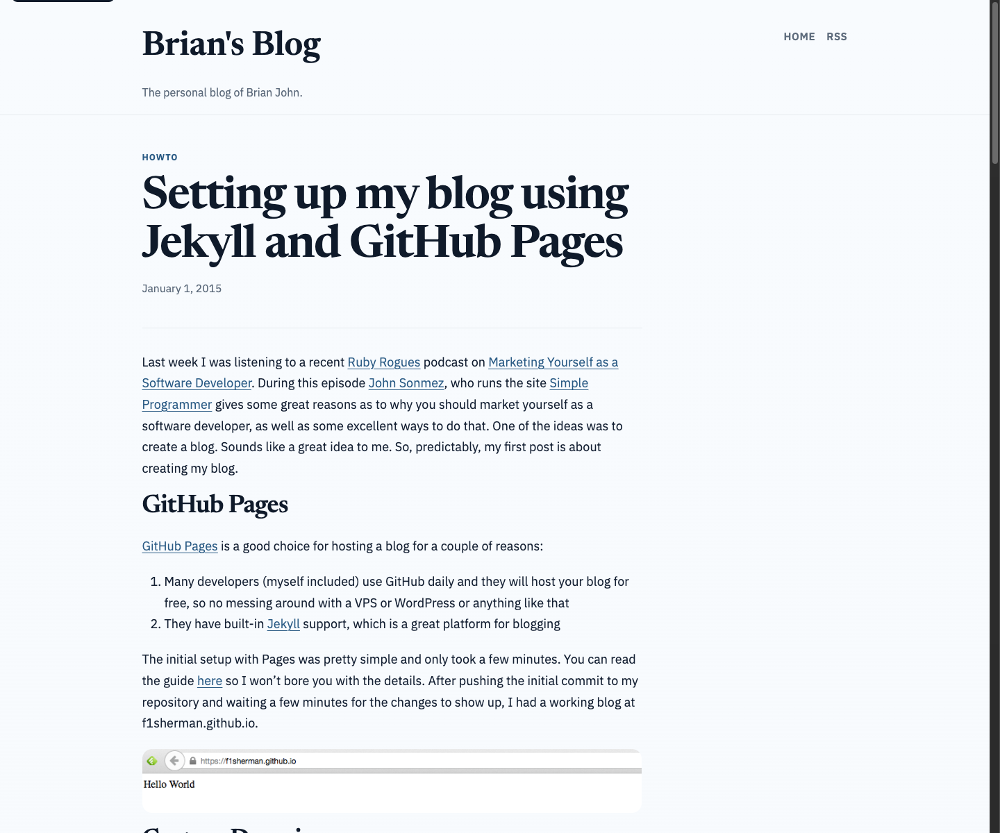
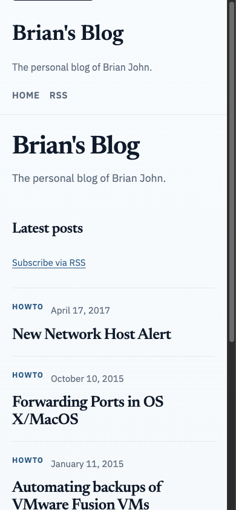

# Blog modernization walkthrough

*2026-04-14T12:46:41Z by Showboat 0.6.1*
<!-- showboat-id: 8733964d-e375-4fa7-bd3f-4587ca2458f0 -->

This walkthrough shows the refreshed site shell, editorial styling, responsive homepage, and the repo-managed Pages build for the branch.

```bash
bundle exec jekyll build
```

```output
Configuration file: /Users/brian/.config/superpowers/worktrees/f1sherman.github.io/blog-modernization/_config.yml
To use retry middleware with Faraday v2.0+, install `faraday-retry` gem
            Source: /Users/brian/.config/superpowers/worktrees/f1sherman.github.io/blog-modernization
       Destination: /Users/brian/.config/superpowers/worktrees/f1sherman.github.io/blog-modernization/_site
 Incremental build: disabled. Enable with --incremental
      Generating... 
DEPRECATION WARNING [import]: Sass @import rules are deprecated and will be removed in Dart Sass 3.0.0.

More info and automated migrator: https://sass-lang.com/d/import

   ╷
37 │   "base",
   │   ^^^^^^
   ╵
    /Users/brian/.config/superpowers/worktrees/f1sherman.github.io/blog-modernization/css/main.scss 37:3  root stylesheet
DEPRECATION WARNING [import]: Sass @import rules are deprecated and will be removed in Dart Sass 3.0.0.

More info and automated migrator: https://sass-lang.com/d/import

   ╷
38 │   "layout",
   │   ^^^^^^^^
   ╵
    /Users/brian/.config/superpowers/worktrees/f1sherman.github.io/blog-modernization/css/main.scss 38:3  root stylesheet
DEPRECATION WARNING [import]: Sass @import rules are deprecated and will be removed in Dart Sass 3.0.0.

More info and automated migrator: https://sass-lang.com/d/import

   ╷
39 │   "syntax-highlighting";
   │   ^^^^^^^^^^^^^^^^^^^^^
   ╵
    /Users/brian/.config/superpowers/worktrees/f1sherman.github.io/blog-modernization/css/main.scss 39:3  root stylesheet
                    done in 0.752 seconds.
 Auto-regeneration: disabled. Use --watch to enable.
```

Homepage on desktop after the redesign.

```bash {image}

```



Existing post layout on desktop, preserving the old content while applying the new shell and typography.

```bash {image}

```



Homepage on a narrow mobile viewport.

```bash {image}

```



```bash
git diff --stat origin/main..HEAD
```

```output
 .github/workflows/pages.yml                        |  58 ++++
 Gemfile                                            |  10 +-
 Gemfile.lock                                       | 246 +++-----------
 README.md                                          |  16 +-
 _config.yml                                        |  17 +-
 _includes/footer.html                              |  91 +-----
 _includes/head.html                                |  22 +-
 _includes/header.html                              |  22 +-
 _layouts/default.html                              |  38 ++-
 _layouts/page.html                                 |  14 +-
 _layouts/post.html                                 |  25 +-
 _sass/_base.scss                                   | 311 +++++++++---------
 _sass/_layout.scss                                 | 364 +++++++++++----------
 _sass/_syntax-highlighting.scss                    |  99 ++----
 assets/js/mermaid-init.js                          |  59 ++++
 css/main.scss                                      |  75 ++---
 .../specs/2026-04-13-blog-modernization-design.md  | 275 ++++++++++++++++
 index.html                                         |  36 +-
 18 files changed, 994 insertions(+), 784 deletions(-)
```
